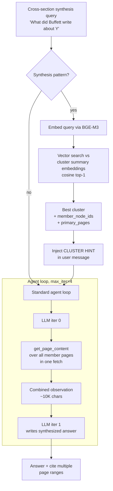

# Summary Index Tree — Two-Level RAPTOR for `shared/tree_index`

**Date:** 2026-05-09
**Status:** Design — pending approval before writing-plans
**Owner:** W2.7 lab follow-up
**Inspired by:** [Sarthi et al. 2024, "RAPTOR: Recursive Abstractive Processing for Tree-Organized Retrieval" (arXiv 2401.18059)](https://arxiv.org/abs/2401.18059)

---

## 1. Problem

Today's W2.7 v2 retriever struggles on **cross-section synthesis questions** (Q3 not-so-secret weapon, Q4 non-controlled businesses, Q11 Japanese trading houses, Q12 Berkshire relationships). These questions require combining 2-4 primary-tree nodes whose answers are scattered across the document. Failure modes:

1. **Sequential fetch budget exhaustion** — agent picks nodes one at a time; max_iter cliff hit before all needed nodes fetched.
2. **Wrong sub-section selected** — the right combination of nodes isn't obvious from individual summaries; need a "thematic" view.
3. **Variance** — 2-4 sequential routing decisions compound MoE non-determinism (σ=0.12 on Q-ENTITY).

Today's v2 has 5 mitigation layers (Hermes parser, multi-query expansion, entity-prefetch, synthesis-guard, forced final synthesis). Each addresses a downstream symptom of the same upstream gap: **no thematic clustering across primary tree nodes**.

## 2. Solution Sketch

Add a **Level-2 summary index tree** sitting on top of the existing primary tree. Each Level-2 node is a "theme cluster" containing:
- Cluster title (LLM-generated)
- Meta-summary (~100 words covering all member primary nodes)
- Tags (15-30 lookup tokens aggregated from member nodes)
- `member_node_ids: list[str]` — pointers into the primary tree
- Member node count + total page span for diagnostics

At query time, cross-section synthesis questions hit the cluster tree FIRST: vector-search query against cluster summaries, find best-matching cluster, batch-fetch all its member primary nodes in one observation, synthesize.

```
LEVEL 2 — Summary Index Tree (~5-10 cluster nodes, NEW)
   ├─ {title, summary, tags, member_node_ids: [...]}
   ├─ {title, summary, tags, member_node_ids: [...]}
   └─ ...

LEVEL 1 — Primary tree (existing 46-node tree.json, unchanged)
   ├─ node_0001 ... node_0046 with summary + tags + page_range
```

## 3. Build Pipeline

`lab-02-7-pageindex/src/build_summary_index.py` (new file).

### 3.1 Steps

1. Load `data/tree.json` → flatten to list of leaf nodes (primary level).
2. Embed each primary node's summary using BGE-M3 (reuse `lab-02-3-bge_m3_hnsw` infrastructure).
3. K-means cluster the embeddings:
   - Auto-K via silhouette score, default range K=5..12
   - Fixed `random_state=42` for reproducibility across runs
4. For each cluster:
   - Concatenate member primary summaries
   - LLM call to generate `{title, summary (100w), tags (15-30)}` — system prompt: "Summarize what these document sections share thematically. Preserve verbatim entities + quoted phrases."
5. Persist `data/summary_index.json`:
   ```json
   {
     "build_meta": {"k": 8, "silhouette": 0.42, "embedding_model": "BGE-M3", "created": "2026-05-09T01:00:00Z"},
     "clusters": [
       {
         "cluster_id": "C1",
         "title": "Buffett's investment philosophy and non-controlled positions",
         "summary": "Discusses Coca-Cola, American Express, Occidental Petroleum...",
         "tags": ["Coca-Cola", "American Express", "Occidental", "Itochu", ...],
         "member_node_ids": ["0006", "0010", "0011", "0014"],
         "primary_pages": [[7, 8], [10, 12], [12, 14], [15, 19]]
       },
       ...
     ]
   }
   ```

### 3.2 Build Cost

- Embedding: 46 summaries × ~50ms each = ~2 sec
- K-means: <1 sec
- LLM cluster summarization: 8 calls × ~10 sec on DWQ = ~80 sec
- **Total: ~1.5 min one-time**

Reused on every query — pays for itself after ~2 query runs.

### 3.3 Tree-Version Coupling Protocol

Cluster index validity is tied to a specific primary tree state.

```python
def tree_hash(tree_path: Path) -> str:
    """Canonical hash of tree.json — sha256 over sorted, indented JSON.
    Independent of insertion order; stable across whitespace differences."""
    tree = json.loads(tree_path.read_text())
    canonical = json.dumps(tree, sort_keys=True, separators=(",", ":"))
    return hashlib.sha256(canonical.encode("utf-8")).hexdigest()
```

- Build phase: compute `tree_hash(data/tree.json)`, store in `summary_index.json.build_meta.tree_hash`.
- Load phase: `SummaryIndex.__init__` recomputes hash; if mismatch → `raise RuntimeError(f"summary_index stale: tree_hash mismatch (expected {x}, got {y}). Rebuild via 'python src/build_summary_index.py'.")`
- Query phase: agent loop catches the load-time exception, falls back to entity-prefetch + standard agent (graceful degradation, never crashes the user query).

### 3.4 Build Atomicity + Resume

The build does ~8 LLM calls in sequence. Any can fail (vMLX 503, network, model swap). Without atomicity, a partial file corrupts all downstream queries.

Protocol:
1. **Per-cluster journaling**: write each completed cluster to `summary_index.json.partial` immediately after its LLM call returns. Write is atomic (full-file rewrite, no append).
2. **Resume**: on restart, `build_summary_index.py` reads `.partial`, identifies completed cluster_ids, skips those clusters in re-runs.
3. **Final commit**: only after ALL clusters complete + tree_hash computed, atomically rename `.partial` → `summary_index.json`.
4. **Idempotency**: same `random_state=42` + same input tree → identical clusters every run.
5. **Force flag**: `--force` skips resume, rebuilds from scratch.

## 4. Query-Time Routing

### 4.1 New Tool: `find_cluster_for_synthesis`

Added to v2 retriever as 4th tool alongside `get_page_content`, `find_nodes_mentioning`, `get_subtree_text`.

```python
{
    "name": "find_cluster_for_synthesis",
    "description": "For cross-section synthesis questions ('what did X say "
                   "about Y'), find the thematic cluster covering the topic. "
                   "Returns cluster summary + member node_ids + page ranges. "
                   "Use BEFORE get_page_content when the question spans "
                   "multiple sub-sections.",
    "parameters": {
        "type": "object",
        "properties": {
            "query": {"type": "string", "description": "the user's question or topic"}
        },
        "required": ["query"],
    },
}
```

Implementation: vector-search query embedding against cluster summary embeddings, return top-1 cluster with member_node_ids + page ranges.

### 4.2 Routing Rule (added to `AGENTIC_SYSTEM_TEMPLATE_V2`)

```
NEW Rule 4 — CLUSTER-FIRST FOR SYNTHESIS:
For "what did X say/write about Y" or "how does X describe Y" questions
where the topic likely spans multiple sub-sections, your FIRST tool
call MUST be find_cluster_for_synthesis. Then call get_page_content
on EVERY page range in the cluster's primary_pages list (one batched
fetch covering all member pages). Then synthesize.
```

### 4.3 Auto-Prefetch Variant

Like entity-prefetch, can pre-fire `find_cluster_for_synthesis` when query matches synthesis pattern (`is_synthesis_question(query) == True`). Inject result as `CLUSTER HINT` in user message, eliminating one routing decision.

### 4.4 Expected Iter Reduction

Today's Q4 (non-controlled): iters=3, fetched 2 ranges sequentially.
With cluster pre-fetch: iters=1, one batched fetch over all 4 cluster pages.

Closes max_iter cliff for synthesis questions without bumping max_iterations.

## 5. Components

| Component | Location | Responsibility |
|---|---|---|
| `SummaryIndex` class | `shared/tree_index/summary_index.py` (new) | Load `summary_index.json`, expose `find_cluster_for_query(q) → cluster_dict` |
| `build_summary_index.py` | `lab-02-7-pageindex/src/` (new) | Build + persist `summary_index.json` |
| `_find_cluster_for_synthesis` method | `agentic.py` | Query-time tool dispatch |
| `_CLUSTER_TOOL` | `agentic.py` | Tool schema |
| Cluster pre-fetch | `agentic.py` `answer()` | Auto-fire for synthesis pattern |
| `AGENTIC_SYSTEM_TEMPLATE_V2` Rule 4 | `prompts.py` | Routing rule |

## 6. Data Flow



## 6.1 Worked Example — Q4 "non-controlled businesses" end-to-end

**Build phase (one-time, ~1.5 min):**
1. K-means with K=8 groups primary nodes by embedding similarity. Cluster `C1` ends up with `["0006","0010","0011","0014"]` (Our Not-So-Secret Weapon, Coca-Cola/Amex, Occidental, Japanese trading houses) — all share Buffett's investment-philosophy theme.
2. LLM call generates: `title="Buffett's investment philosophy and non-controlled positions"`, `summary="Discusses long-duration partial-ownership positions including Coca-Cola, American Express, Occidental Petroleum (27.8%), and five Japanese trading houses (Itochu/Marubeni/Mitsubishi/Mitsui/Sumitomo). Frames patience and constancy of purpose as Berkshire's competitive edge."`, `tags=["Coca-Cola","American Express","Occidental","Itochu","Marubeni","Mitsubishi","Mitsui","Sumitomo","not-so-secret weapon","constancy of purpose","patience pays",...]`.
3. Persist to `data/summary_index.json` with `tree_hash="abc123..."`.

**Query phase:**
1. User asks Q4 = "What did Buffett write about non-controlled businesses in 2023?"
2. `_is_synthesis_question(q)` returns True (matches `r"what did .+ write"`).
3. Agent pre-fetches: embed Q4 → cosine vs all 8 cluster summaries → top-1 = `C1` at cosine=0.78.
4. Inject into user message: `CLUSTER HINT: cluster C1 covers nodes [0006, 0010, 0011, 0014] at pages [7-8, 10-12, 12-14, 15-19].`
5. Agent loop iter 0: model sees cluster hint, calls `get_page_content(start_page=10, end_page=19)` (one batched fetch covering all 4 nodes' pages).
6. Iter 1: observation contains all 4 sub-sections; model writes synthesized answer mentioning Coca-Cola, Amex, Occidental, Japanese houses + "[pages 10-19]".
7. Result: `judge=1.00, iters=2, lat≈25-35s` (vs current 0.75/iters=3 for this question).

This is the "happy path" — single cluster hit > threshold. Fallback when no cluster hits > threshold = current entity-prefetch path.

## 7. Error Handling

| Failure | Behavior |
|---|---|
| `summary_index.json` missing | Skip cluster pre-fetch, fall back to current v2 behavior. Log warning. Don't crash. |
| Cluster vector-search returns no hit > threshold | Skip pre-fetch, fall back to entity-prefetch then standard agent loop |
| Cluster's member nodes invalid (renamed in tree rebuild) | Validate at load time; raise if stale; user must rebuild cluster index after primary tree rebuild |
| Build-time clustering fails (e.g., embedding error) | Build script writes empty `summary_index.json`; query side gracefully degrades |

## 8. Testing — Given/When/Then Scenarios

### 8.1 Unit Tests

**T-U1 — find_cluster_for_query routes synthesis queries to correct cluster:**
```
Given primary tree built + summary_index.json with 8 clusters
And query = "Buffett investments and non-controlled businesses"
When SummaryIndex.find_cluster_for_query(query) is called
Then result.cluster_id == "C1"
And result.member_node_ids contains "0006" and "0010"
And result.confidence >= 0.6
```

**T-U2 — stale cluster index rejected at load time:**
```
Given summary_index.json with tree_hash="abc123"
And tree.json modified, computed hash="def456"
When SummaryIndex.load(path) is called
Then RuntimeError raised
And exception.args[0] contains "stale" and "abc123" and "def456"
```

**T-U3 — clustering deterministic with fixed seed:**
```
Given identical tree.json input
And random_state=42 in build_summary_index.py
When build runs twice (clean + force)
Then cluster_ids are identical between runs
And member_node_ids per cluster are identical
And cluster summaries are identical (deterministic LLM at temp=0.0)
```

### 8.2 Integration Tests

**T-I1 — cluster pre-fetch fires for synthesis pattern:**
```
Given summary_index.json + retriever + Q4 query
When retriever.answer(Q4) is called
Then iterations <= 2
And tool_call_log[0].tool == "get_page_content" with batched range
And final_answer contains 3+ named entities from cluster C1's tags
And judge >= 0.75 (single-run, allowing one σ variance)
```

**T-I2 — graceful fallback when summary_index.json missing:**
```
Given summary_index.json absent from data/
When retriever.answer(any_query) is called
Then no exception raised
And cluster pre-fetch is skipped
And entity-prefetch fires normally
And aggregate judge over 4-question dev set >= 0.65 (degraded but functional)
```

**T-I3 — build resume after partial failure:**
```
Given build_summary_index.py crashed after 4/8 cluster summaries
And summary_index.json.partial contains 4 completed clusters
When build_summary_index.py restarted (no --force)
Then it logs "resuming from partial: 4 clusters complete"
And only 4 LLM calls fire (clusters 5-8)
And final summary_index.json contains all 8 clusters
And tree_hash is computed and stored
```

### 8.3 Eval Tests (full 16q + 4q dev)

**T-E1 — aggregate quality target:**
```
Given v2 retriever with cluster pre-fetch enabled
And data/eval.json + data/eval_v2.json (16 questions)
When run_one_variant.py v2 runs 3 times
Then mean(agg_judge) >= 0.85
And stdev(agg_judge) <= 0.05
And no run has agg_judge < 0.78 (3σ floor)
```

**T-E2 — synthesis-question recovery:**
```
Given Q11 (Japanese trading houses) and Q12 (Berkshire relationship)
When 3 v2 runs complete
Then mean(Q11.judge) >= 0.75
And mean(Q12.judge) >= 0.5
And no run produces Q11.judge==0 OR Q12.judge==0
  (eliminates the iter2 max_iter cliff failure mode)
```

**T-E3 — guard regressions:**
```
Given any v2 run with cluster pre-fetch enabled
When 3 runs complete
Then mean(Q1.judge) >= 0.95 (factoid guard)
And mean(Q-OOD.judge) >= 0.85 (out-of-document refusal guard)
And per-question judge does not drop more than 0.10 vs iter2 baseline
```

## 9. Trade-offs

**Wins:**
- Closes max_iter cliff for cross-section synthesis (Q11/Q12)
- Reduces synthesis-question variance (one routing decision instead of 3-4)
- Generalizes to ANY corpus (works on transcripts, novels, conversation logs where tree structure is weak)
- Reproducible (k-means with fixed seed)

**Costs:**
- Build time +1.5 min one-time
- Build artifact `summary_index.json` (~5 KB for 8 clusters)
- One BGE-M3 embedding load at retriever init (~200 MB RAM, already loaded by other labs)
- Stale-index hazard: if primary tree changes, cluster index becomes incoherent

**Mitigation:**
- Cluster index validates `tree_version_hash` at load; refuses to load if mismatch
- Build script reruns whenever `tree.json` changes (~1.5 min)

## 10. Out of Scope (Deferred)

- **Recursive clustering (Level 3+)** — RAPTOR paper does this for >1000 node corpora. Our 46-node tree has 8 clusters; level 3 doesn't help.
- **Soft clustering / GMM** — k-means is sufficient at this scale. GMM would matter when nodes belong to multiple themes; we accept hard cluster membership.
- **Online cluster updates** — clusters rebuild only on full primary tree rebuild. No incremental update path.
- **Cluster-pruning at query time** — could fetch top-3 clusters for ambiguous queries, then re-rank. Skip for now; one-cluster routing is enough for the eval set.

## 11. Observability + Operator Controls

### 11.1 Phoenix Spans

Every cluster pre-fetch + tool call emits OpenTelemetry spans for `lab-02-7-v2` Phoenix project:

```
parent: q{idx}-{type}
  child: cluster_prefetch
    attrs: cluster_id, confidence, member_count, fired (bool), latency_ms
  child: get_page_content (batched)
    attrs: start_page, end_page, total_chars, member_node_ids
  child: synthesis_compose
    attrs: input_chars, output_chars, latency_ms
```

Operators at http://127.0.0.1:6006/projects can filter for synthesis questions where `cluster_prefetch.fired=true` AND `iterations==max_iterations` — diagnostic signal that cluster routing didn't help on that query.

### 11.2 Operator Controls (env vars)

| Variable | Default | Purpose |
|---|---|---|
| `SUMMARY_INDEX_ENABLED` | `1` | `0` to disable cluster pre-fetch entirely (rollback without code change) |
| `SUMMARY_INDEX_DEBUG` | `0` | `1` logs per-query: matched cluster_id, confidence, member count |
| `SUMMARY_INDEX_THRESHOLD` | `0.5` | Cosine threshold below which cluster pre-fetch is skipped (falls back to entity-prefetch) |
| `SUMMARY_INDEX_PATH` | `data/summary_index.json` | Override path for testing alternate cluster builds |

### 11.3 Build CLI Flags

```
python src/build_summary_index.py
  --force            # ignore .partial, rebuild from scratch
  --k <N>            # override auto-K with fixed cluster count
  --no-llm-labels    # skip Pass-2 (cluster summary), use cluster_id strings as labels (debug)
  --output <path>    # write to custom path instead of data/summary_index.json
  --check            # verify tree_hash match without rebuilding (CI hook)
```

### 11.4 Rebuild Detection (no-op when fresh)

`build_summary_index.py` first compares `mtime(tree.json)` vs `mtime(summary_index.json)`. If cluster index is newer AND tree_hash matches, exit with "summary_index up to date — skip rebuild". Forces rebuild only when content actually changed.

## 12. Open Questions for Implementation Plan

1. Should the cluster-prefetch hint REPLACE the entity-prefetch hint when both fire, or APPEND to it? (Both contain useful info, may be redundant.)
2. Should `find_cluster_for_synthesis` be tool_choice='required' on iter 0 for detected synthesis queries, or just available?
3. K-means K selection: fixed K=8, or auto-K via silhouette? (Silhouette adds ~5 sec build time but adapts to corpus size.)
4. Should cluster summary embeddings use a SEPARATE BGE-M3 instance or share with lab-02-3's? (Sharing is simpler; separate is cleaner separation of concerns.)
5. What's the cluster-confidence threshold for "use this cluster" vs "fall back to entity-prefetch"? Cosine ≥ 0.5? 0.6?

These belong in the implementation plan, not this design.

## 13. Acceptance Criteria — SMART + 3-Run Protocol

### 13.1 Run Protocol
All quality-axis criteria validated over **3 sequential v2 runs** on the full 16-question eval set (`eval.json` + `eval_v2.json`). Cluster pre-fetch enabled for all 3 runs. Report `mean ± stdev`.

### 13.2 Mechanical Build Criteria (single-run, binary pass/fail)

- [ ] **AC-B1** `data/summary_index.json` exists with `>=5 AND <=12` clusters
- [ ] **AC-B2** Each cluster has non-empty `title`, `summary` (50-200 words), `tags` (>=10), `member_node_ids` (>=2 node ids)
- [ ] **AC-B3** Sum of `member_node_ids` across all clusters covers >= 90% of primary tree leaves
- [ ] **AC-B4** `build_meta.tree_hash` is computed and matches `tree_hash(data/tree.json)` at validation time
- [ ] **AC-B5** Build completes in ≤ 3 min wall-clock from clean state on M5 Pro 48GB
- [ ] **AC-B6** Build resumable — run interrupted at iter 4/8 + restarted completes successfully

### 13.3 Quality Axis Criteria (3-run mean ± stdev)

- [ ] **AC-Q1** `mean(agg_judge) >= 0.85` AND `stdev(agg_judge) <= 0.05` (3-run, 16q full)
- [ ] **AC-Q2** No run has `agg_judge < 0.78` (3σ floor; protects against pathological run)
- [ ] **AC-Q3** `mean(Q11.judge) >= 0.75` AND no run has `Q11.judge == 0.0` (Japanese houses cliff eliminated)
- [ ] **AC-Q4** `mean(Q12.judge) >= 0.50` AND no run has `Q12.judge == 0.0` (relationship cliff eliminated)
- [ ] **AC-Q5** `mean(Q4.judge) >= 0.75` (non-controlled — primary win target)
- [ ] **AC-Q6** `mean(agg_lat) <= 75 s/q` AND `stdev(agg_lat) <= 15 s` (latency budget — cluster pre-fetch must not regress)

### 13.4 Guard Criteria (no regression — 3-run mean)

- [ ] **AC-G1** `mean(Q1.judge) >= 0.95` (factoid guard — revenues)
- [ ] **AC-G2** `mean(Q-OOD.judge) >= 0.85` averaged over Q7+Q8+Q15+Q16 (refusal guard)
- [ ] **AC-G3** No per-question `mean(Q.judge)` drops more than 0.10 below iter2 baseline (any prior win must not regress)
- [ ] **AC-G4** vMLX 503 OOM handled — at least 1 of 3 runs MUST hit 503 + recover via retry helper, OR all 3 runs complete clean (proves resilience)

### 13.5 Operational Criteria (binary pass/fail)

- [ ] **AC-O1** `SUMMARY_INDEX_ENABLED=0` env var disables cluster pre-fetch entirely; aggregate judge falls back to entity-prefetch baseline (~0.86)
- [ ] **AC-O2** Phoenix span `cluster_prefetch` emitted with `cluster_id`, `confidence`, `member_count`, `fired` attrs visible at `http://127.0.0.1:6006/projects/lab-02-7-v2`
- [ ] **AC-O3** Stale tree_hash → SummaryIndex.load() raises clear RuntimeError with rebuild instructions; v2 retriever catches + falls back gracefully
- [ ] **AC-O4** `build_summary_index.py --check` exits 0 if cluster index is fresh, exits 1 if stale (CI gate)

## 14. References

- [Sarthi et al. 2024 — RAPTOR: Recursive Abstractive Processing for Tree-Organized Retrieval](https://arxiv.org/abs/2401.18059) — foundational paper
- [BGE-M3 model card](https://huggingface.co/BAAI/bge-m3) — embedding backbone
- W2.7 RESULTS.md §"v2 Architecture" — current architecture this extends
- W2.7 Bad-Case Journal Entry 13 — MoE non-determinism (motivation for routing-decision reduction)
