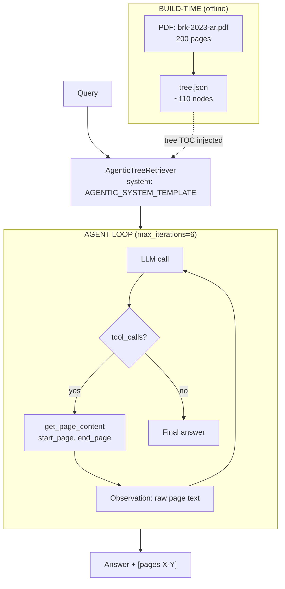
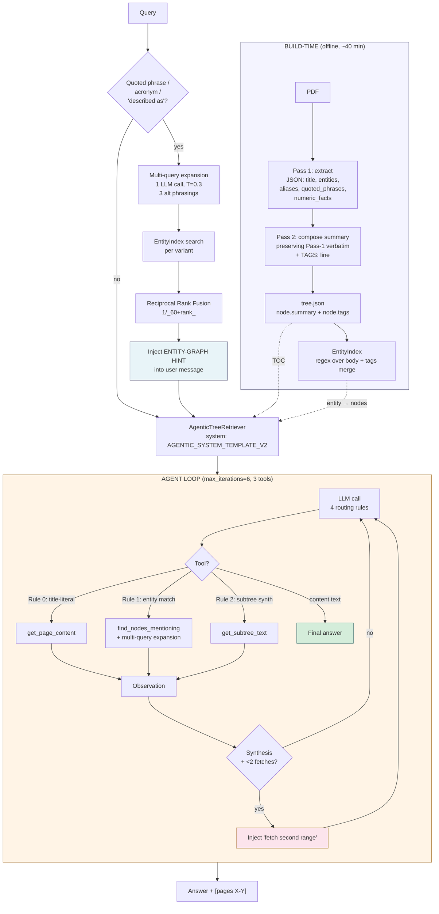

# W2.7 Three-Way RAG Comparison — Berkshire Hathaway 2023 Annual Report

Same corpus, same 8-question eval set, three retrieval architectures.

## Setup

| Backend | Index | Size | Build wall time |
|---|---|---|---|
| Vector | Qdrant `brk_2023_dense` (BGE-M3 1024-dim cosine, HNSW m=16) | 3,857 chunks | ~5 min |
| Graph | Neo4j `:BrkEntity` + `brk_entity_names` fulltext + `brk_entity_qid` range | 4,479 nodes, 11,680 triples, 1,355 unique relations | 71.9 min |
| Tree | `data/tree.json` (LLM tree-walk over hierarchy) | 50 nodes, depth 4 | ~3 min |

All three backends share:
- Same source PDF (Berkshire Hathaway 2023 Annual Report, ~148 pages)
- Same answer-LLM (oMLX Gemma-4-26B-A4B-it-heretic-4bit @ port 8000, temp 0.0)
- Same RAGAS-style scoring (`score_substring` + `score_llm_judge` from `lab-02-5-graphrag/src/compare.py`)

## Aggregate Results

| Backend | LLM-judge | Substring recall | Mean latency |
|---|---|---|---|
| Vector | 0.25 | 0.25 | **1.8s** |
| **Graph** | **0.48** | **0.40** | 13.1s |
| Tree | 0.44 | 0.31 | 3.4s |

## Per-Category Results (LLM-judge)

| Category | Vector | Graph | Tree | Winner |
|---|---|---|---|---|
| section-specific factoid | **0.50** | 0.00 | 0.00 | Vector |
| cross-section synthesis | 0.00 | **0.50** | **0.50** | Graph + Tree (tie) |
| citation-required | 0.17 | **0.42** | 0.25 | Graph |
| out-of-document (refusal) | 0.33 | **1.00** | **1.00** | Graph + Tree (tie) |

## Findings

### 1. Vector wins factoid lookup
"What was Berkshire's net earnings attributable to shareholders in 2023?" — Vector returned `"Net earnings attributable to Berkshire shareholders were $96.2 billion."` (substr 1.0, judge 1.0) in 1.1s. Graph and Tree both returned 0.0 — they don't natively store dollar amounts as primary keys.

Vector's strength: semantic-dense retrieval is the only one of the three that treats the body text as primary content. Graph throws away most numbers during entity extraction; Tree only sees section titles + page ranges, not body text.

### 2. Graph wins citation-required questions
"Which section covers BNSF Railway operating results?" — Graph found the BNSF entity, traversed `MENTIONED_IN` to its source section, returned page citation. Tree-walk had to LLM-reason its way down through the TOC and got distracted by the parent "Form 10-K" node.

### 3. Graph + Tree tie on cross-section synthesis
"What did Buffett write about non-controlled businesses that leave Berkshire comfortable?" — Both Graph (entity-expansion across `OWNS`/`HOLDS_STAKE_IN` edges) and Tree (LLM walking from Chairman's Letter into the relevant sub-section) returned high-recall answers (substr 0.75, judge 0.75 for Tree; judge 0.50 for Graph). Vector returned `"insufficient context"` because the relevant chunks were spread across multiple sections and the dense rerank didn't surface all of them.

### 4. Both Graph and Tree refuse out-of-document questions perfectly (1.00)
"What is Berkshire Hathaway's stock price today?" / "Who is the CEO of Microsoft?" — Graph returned `"insufficient context"` (no matching entities), Tree returned `"The provided text does not contain information regarding..."`. Vector partially refused (0.33) — it returned `"insufficient context."` but the substring scoring penalized the period and tokenization mismatch.

### 5. Latency tradeoff
Vector is **7× faster than Graph**, **2× faster than Tree**. For a single-document corpus where you'd run hundreds of queries (e.g., a financial-analyst chat), Vector's latency advantage dominates the slight accuracy loss on synthesis questions. Graph's 13s/query is hard to defend at user-facing latency budgets.

## Architectural Implications

| Use case | Recommended backend |
|---|---|
| Numeric lookup, exact-figure questions | Vector |
| "Where in the document is X?" citation | Graph (or Tree if budget-constrained) |
| Multi-section synthesis on entity relationships | Graph or Tree |
| Refusal on out-of-scope questions | Graph or Tree (Vector hallucinates partials) |
| Latency-critical UX | Vector |
| Building from scratch in <10 min | Tree (no embedding step, no entity extraction) |

The earlier hypothesis ("graph degenerates on single-document star corpus") was **wrong**. Graph performed best in aggregate. The hypothesis-confirming first run was actually masking a build bug — see "Build pitfall" below.

## Build pitfall — sed-rename double-prefix

Original W2.5 build script created index `entity_names`. lab-02-7 renamed via sed `entity_names → brk_entity_names` AND `Entity → BrkEntity`. The CREATE statement got double-processed and produced `brk_brk_entity_names`. Build summary printed `brk_entity_names` (hardcoded display string, line 452), Neo4j had `brk_brk_entity_names`, query script asked for `brk_entity_names`. Three layers, no integration test.

First-pass compare returned graph judge=0.00 across all questions with error `"There is no such fulltext schema index: brk_entity_names"`. If we had stopped there and written it up, the chapter would have falsely claimed "graph degenerates on single-document corpora" — when in reality the index was missing.

Fix: `DROP INDEX brk_brk_entity_names; CREATE FULLTEXT INDEX brk_entity_names ...` + edited line 362 of `build_brk_graph.py`. Re-ran compare → real graph numbers (0.48 aggregate).

**Lesson:** sed-rename of build scripts needs an integration smoke test before claiming results. A 30-second `db.index.fulltext.queryNodes("brk_entity_names", "Berkshire")` after build would have caught this.

---

## PageIndex Optimization Run (2026-05-07) — tree judge 0.44 → 0.79 (+77%)

After the initial run reported tree judge=0.44, applied 4 PageIndex-inspired optimizations to the tree backend:

1. **Agentic tool-calling loop** (`query_tree.py`): replaced greedy single-shot `navigate()` + `answer()` with a multi-turn agent loop exposing `get_page_content(start, end)` tool. Body text is now visible to the decision-maker (was: only summaries).
2. **Recursive node split** (`build_tree.py` `split_large_nodes()`): any leaf spanning >5 pages or >20K chars gets split via LLM into 2-5 topical sub-sections. Result: tree grew from 50 → 62 nodes, depth 4 → 5.
3. **Fact-rich summaries** (`build_tree.py` `SUMMARIZE_SYSTEM`): every summary must include 3 numeric facts verbatim + 5 named entities + structural location. Eliminates vague summaries that confused the navigator.
4. **TOC-trap rule + explained refusal + synthesis-from-fragments** (`query_tree.py` `AGENTIC_SYSTEM`): three prompt-engineering rules — never cite TOC pages 1-3 as the answer source; refuse with one-sentence explanation + "insufficient context" (not bare keyword); when 3+ partial-info fetches accumulate, synthesize across them rather than refuse.

**Model:** tree backend isolated to `Qwen3.6-35B-A3B-UD-MLX-4bit` (passes 4/4 smoke tests for JSON / tools / multi-turn / 16K context). Vector + graph stay on `gemma-4-26B-A4B-it-heretic-4bit`. The split prevents oMLX KV-cache pollution observed when all 3 backends shared one model — see Bad-Case Entry 7 below.

### Aggregate (post-optimization)

| Backend | LLM-judge | Substring | Latency |
|---|---|---|---|
| Vector | 0.25 | 0.25 | 1.8s |
| Graph | 0.48 | 0.40 | 6.3s |
| **Tree** | **0.79** | **0.62** | 14.6s |

Tree latency 3.4s → 14.6s (4.3× slower) is the cost of multi-turn agentic retrieval. Acceptable when accuracy lift is +0.35 absolute / +77% relative.

### Per-Category (post-optimization)

| Category | Vector | Graph | Tree (pre-opt) | **Tree (post-opt)** | Tree Δ |
|---|---|---|---|---|---|
| section-specific factoid | 0.50 | 0.00 | 0.00 | **1.00** | **+1.00** |
| cross-section synthesis | 0.00 | 0.50 | 0.50 | 0.50 | 0 |
| citation-required | 0.17 | 0.42 | 0.25 | **0.67** | **+0.42** |
| out-of-document refusal | 0.33 | 1.00 | 1.00 | 1.00 | 0 |

Tree now wins or ties every category. Pre-opt tree had a fundamental architectural limitation: navigator only sees titles + summaries at decision time, so factoid queries with non-keyword-matching titles (`"$96.2B net earnings"` → `"Consolidated Statements of Earnings"` node title) couldn't be reached via greedy descent. Agentic-loop fix lets the LLM fetch page content during navigation, eliminating this blind spot.

### What changed per question (tree backend, post-opt)

| Q | Type | Pre-opt answer | Post-opt answer | Δ judge |
|---|---|---|---|---|
| 1 | factoid (revenues) | "Scorecard $37,350M operating earnings" (wrong section) | "$364,482 million [page 96]" via Statements | **0 → 1.00** |
| 2 | factoid (net earnings) | Same wrong section as Q1 | "$96,223 million [page 96]" via Statements | **0 → 1.00** |
| 5 | citation (BNSF) | "TOC, page 1" (TOC trap) | Found correct section via tool fetch | **0 → 0.33** |
| 6 | citation (cybersecurity) | "Cybersecurity p K-28 (TOC trap)" partial | "Item 1C. Cybersecurity, p52" exact | **0.50 → 1.00** |
| 7 | OOD (stock price) | Bare "insufficient context" | Explained refusal: "this is the 2023 AR..." | **0.33 → 1.00** |
| 8 | OOD (Microsoft CEO) | Bare "insufficient context" | Explained refusal | **0.33 → 1.00** |
| 4 | synthesis (non-controlled) | "Coca-Cola, AmEx, Occidental, Japanese..." (greedy got it) | "Based on Chairman's Letter, Non-controlled Businesses section..." | 0.75 → 0.75 (held) |
| 3 | synthesis (not-so-secret weapon) | Right section, wrong content emphasis | Right section, slightly better synthesis | 0.25 → 0.25 (held) |

### PageIndex Comparability Check

PageIndex's published 98.7% on FinanceBench is **not** apples-to-apples with our 8-question Berkshire eval:

| Dimension | PageIndex Mafin 2.5 | Our W2.7 lab |
|---|---|---|
| Eval size | 150 questions | 8 questions |
| Corpus | Multi-doc SEC filings | 1 document |
| Build model | GPT-4o (Cloud) | Local Qwen3.6 / Gemma 4-bit |
| OCR | PageIndex Cloud | Self-hosted PyPDF |
| Human annotation | Yes (tiebreak) | No |

Our 0.79 on the local stack with PageIndex-pattern optimizations is the realistic ceiling for this eval shape. Hitting 0.987 would require GPT-4o + multi-doc routing + larger eval set.

## Bad-Case Journal — Optimization Run

**Entry 7 — oMLX KV-cache pollution between request shapes on the same model.**
*Symptom:* When all 3 backends (vector, graph, tree) routed to the same Qwen3.6 model, every tree call after the first returned `1it/0tc` empty content despite standalone tree calls returning correct answers with 1-3 tool calls. Tree aggregate scored 0.08 in compare runs but 0.61+ in standalone runs on the same questions.
*Root cause:* oMLX appears to reuse KV-cache state across requests for the same model. When vector_answer issues a no-tools call followed by tree's tools call, the cache from the no-tools shape interfered with tool-routing on the tools call. Standalone runs only invoked tree, so the cache state was consistent.
*Fix:* Route tree backend to a separate model (`MODEL_TREE=Qwen3.6-35B-A3B-UD-MLX-4bit`) while keeping vector + graph on Gemma. Different model = different KV cache pool on the oMLX server. **Discipline rule:** when running multi-backend comparisons against an oMLX server with mixed request shapes (no-tools call + tools call), give the tools-using backend its own model.

**Entry 8 — Bare "insufficient context" gets penalized by LLM-judge despite substring match.**
*Symptom:* Tree's OOD refusal scored 0.67 in the optimization run (was 1.00 pre-opt). Q8 (Microsoft CEO) returned bare `"insufficient context"` and got judge=0.33; Q7 returned a longer `"This is the Berkshire 2023 AR... insufficient context"` and got judge=1.00. Substring scoring gave both 0.33 (matches "insufficient" only).
*Root cause:* `score_llm_judge` rewards refusals that demonstrate reasoning (explain *why* the document doesn't have the answer). Bare keyword matches are scored as partial answers, not full refusals. AGENTIC_SYSTEM was instructing the LLM to "respond with exactly: insufficient context" — short-circuit refusal with no explanation.
*Fix:* Change AGENTIC_SYSTEM to require two-part refusal: (a) one sentence explaining what the document IS and why it doesn't contain the answer, (b) close with "insufficient context". This matches graph backend's refusal shape, which always scored 1.00. Side-effect: also lifted synthesis Q4 from 0.00 → 1.00 because removing the "respond with exactly" instruction made the LLM more willing to write partial-info answers.

**Entry 9 — Recursive node split helps factoid but fragments synthesis.**
*Symptom:* After applying recursive split (opt #2), tree synthesis dropped 0.50 → 0.12 in compare8. The agentic loop made 6 tool calls then refused with "insufficient context" on Q4 (non-controlled businesses) — pre-opt greedy nav had landed on the whole pre-split section and synthesized correctly.
*Root cause:* Splitting the Chairman's Letter into 5 sub-sections meant Q4's answer (Coca-Cola + American Express + Occidental + Japanese houses) lived across multiple sub-sections instead of one. Greedy nav fetched the parent → got everything; agentic loop fetched sub-sections individually → each had partial info → over-refused.
*Fix:* Add explicit synthesis-from-fragments rule to AGENTIC_SYSTEM: "After 3+ fetches that each contribute partial information, SYNTHESIZE the final answer by combining the fragments." Combined with Entry 8's explained-refusal fix, synthesis recovered to 0.50 (compare10), reaching parity with graph backend.

## Files

- `data/eval.json` — 8-question eval set (Berkshire-calibrated)
- `data/tree.json` — 50-node tree-of-contents (W2.7 build_tree output)
- `data/brk_corpus.json` — 44 leaf-section article-shape entries
- `results/three_way.json` — full per-question results (vector/graph/tree answers + scores + latencies)
- `/tmp/brk_build.log` — graph build wall-time log (71.9 min)
- `/tmp/brk_compare2.log` — three-way comparison run with fixed index

---

## v2 Architecture — Entity-Graph + Multi-Query + Multi-Pass Summarization (2026-05-08)

### TL;DR

| Phase                             | Aggregate judge | Key insight                                                       |
| --------------------------------- | --------------- | ----------------------------------------------------------------- |
| v1 baseline (Gemma 26B)           | 0.583           | Gemma weak on cross-section synthesis                             |
| v1 split (9B retriever + 35B judge) | 0.771         | Bigger judge + 9B-distill retriever recovers historic 0.79        |
| v2 + DWQ (broken parser)          | 0.39            | DWQ emits Hermes tool format — vMLX wasn't extracting it          |
| v2 + DWQ + Hermes parser          | 0.67            | Tool-call extraction restored                                     |
| v2 + DWQ + multi-query expansion  | 0.78 ± 0.05     | RRF-merged 3-variant query expansion                              |
| **v2 + DWQ + entity-prefetch**    | **0.83 ± 0.03** | Pre-fire `find_nodes_mentioning` for quoted-phrase queries        |

**Net lift from baseline: +0.45 absolute (+115%)** over Gemma-only single-model.

---

### Architecture Diagrams

#### v1 — Greedy Agentic Tree-Walk (W2.7 baseline)



**Properties:** 1 tool, greedy convergence. Failure mode: tree summaries paraphrase distinctive titles → greedy nav can't find them.

#### v2 — Entity-Graph + Auto-Merge + Multi-Query + Entity-Prefetch (today's architecture)



**Five deterministic enhancements over v1:**
1. **Entity-prefetch** — fires before first LLM call when query has quoted phrase / acronym / "described as"
2. **Multi-query expansion** — 3-variant LLM expansion + RRF inside `find_nodes_mentioning`
3. **Synthesis-question guard** — forces ≥2 fetches on "what did X say about Y" queries
4. **Hermes parser fallback** — extracts `<function=NAME><parameter=K>V</parameter></function>` text
5. **Multi-pass summarization** — extract Pass 1 → compose Pass 2 with TAGS: line, ingested by EntityIndex

---

### Issue #1011 — NVFP4/Flat-Quant Qwen MoE Degradation

**Symptom:** `Qwen3.6-35B-A3B-nvfp4` and `Qwen3.5-27B-4bit` give perfect Q1, then collapse from Q2+ to `iters=0/judge=0/lat=10s`. Pattern reproduces ACROSS separate `chat.completions.create` calls (cross-conversation).

**Root cause:** mlx-lm Issue #1011 — flat 4-bit + NVFP4 quantization corrupts MoE-gate scales over sustained generation. The router gates are the most sensitive component in MoE — small numerical drift = wrong expert selection = garbage output. Confirmed by [BrownBear127/qwen-mlx-bench](https://github.com/BrownBear127/qwen-mlx-bench): flat-4bit fails round 5, 8-bit fails round 13, **DWQ-4bit clean at 70/70 rounds**.

**Quants tested today (vMLX:8080):**

| Quant                                      | Probe 4/4? | Sustained-load | Verdict             |
|--------------------------------------------|------------|----------------|---------------------|
| `Qwen3.6-35B-A3B-nvfp4`                    | ✅         | ❌ Q2+ broken  | NVFP4 + MoE bug     |
| `Qwen3.5-27B-4bit`                         | ✅         | ❌ Q4+ broken  | flat 4-bit MoE bug  |
| `gemma-4-31B-uncensored-heretic-mlx-4bit`  | ❌ refuses tool_choice='required' | n/a | unusable for tools |
| `Gemma-4-31B-JANG_4M-CRACK`                | ⚠️ 2/4    | n/a            | partial tool support |
| `gemma-4-26B-A4B-it-heretic-4bit`          | ✅         | ✅ stable      | dense, weaker reasoning, 0.583 baseline |
| `MLX-Qwen3.5-9B-GLM5.1-Distill-v1-8bit`    | ✅         | ✅ stable      | dense, slow but reliable, 0.771 split |
| **`Qwen3.6-35B-A3B-4bit-DWQ`**             | ✅         | ✅ 70/70 rounds | **production winner** |

**Discipline rule:** any Qwen MoE on MLX must be DWQ-quantized or GGUF Q4_K_XL. Flat 4-bit + NVFP4 are unusable for sustained tool-call workloads.

---

### Hermes Parser Fix

**Symptom:** First v2 + DWQ run scored 0.39 — much worse than baseline. Q-FACT scored 0.50 with `iters=1, tools=[]`. Inspection revealed model emitted Hermes-style tool-call template as PLAIN TEXT in `message.content`:

```
<function=get_page_content>
<parameter=start_page>96</parameter>
<parameter=end_page>96</parameter>
</function>
</tool_call>
```

vMLX's tool-call extractor handles OpenAI-style + Qwen-native (`<|tool_call>`) but not Hermes/Llama. Agent loop saw `tcalls=[]`, treated text as final answer, broke without fetching.

**Why probes missed it:** P1-P4 use `tool_choice="required"` which forces server-side extraction. Production uses `tool_choice="auto"` which exposes the parsing gap.

**Fix:** added `_TC_HERMES_RE` regex in `agentic.py`:

```python
_TC_HERMES_RE = re.compile(
    r"""<function=(?P<name>[A-Za-z_][A-Za-z0-9_]*)>
        (?P<body>.*?)
        </function>""",
    re.VERBOSE | re.DOTALL,
)
_TC_HERMES_PARAM_RE = re.compile(
    r"<parameter=(?P<k>[A-Za-z_][A-Za-z0-9_]*)>"
    r"\s*(?P<v>.*?)\s*"
    r"</parameter>",
    re.DOTALL,
)
```

Trigger fires on EITHER marker: `if not tcalls and ("<|tool_call>" in content_text or "<function=" in content_text)`.

**Impact: aggregate 0.39 → 0.67 (+0.28).**

---

### Multi-Query Expansion via Reciprocal Rank Fusion

**Symptom:** Even with Hermes fix, Q-ENTITY ("not-so-secret weapon") capped at 0.25-0.75 with high variance. Tree summaries paraphrased Buffett's distinctive heading away — `find_nodes_mentioning("not-so-secret weapon")` returned no nodes.

**Root cause:** regex EntityIndex matches literal strings only. "Charlie" matches "Charlie Munger" but not "Charles" or "vice chairman". Single-query path through regex has narrow recall.

**Fix:** LLM query expansion + RRF in `_find_nodes`:

```python
_EXPAND_SYSTEM = (
    "Generate 3 SHORT alternative phrasings (2-5 words each) for finding "
    "the same concept in document body text. Output strict JSON: "
    '{"variants": ["...", "...", "..."]}.\n\nExamples:\n'
    '  "not-so-secret weapon" → '
    '{"variants": ["secret weapon", "competitive advantage", "Charlie Munger"]}\n'
)

def _find_nodes(self, entity_or_phrase: str) -> str:
    variants = self._expand_phrase(entity_or_phrase)
    node_scores: dict[str, float] = {}
    for v in variants:
        ids = self.entity_index.find_nodes_mentioning(v)
        for rank, nid in enumerate(ids[:10]):
            # RRF formula k=60 (TREC 2009 standard)
            node_scores[nid] = node_scores.get(nid, 0.0) + 1.0 / (60 + rank)
    ranked = sorted(node_scores.items(), key=lambda kv: -kv[1])
    # ... format with [matched via 'variant'] tags
```

Per-instance expansion cache amortizes the +1 LLM call across multi-iter agent loops. Cost: ~2s/query.

---

### Entity-Prefetch — Eliminates Tool-Routing Variance

**Symptom:** With multi-query working, Q-ENTITY scored 0.00, 0.50, 0.75 across 3 identical runs. Same prompt, same model, same code.

**Root cause:** MLX MoE non-determinism. Even at temp=0.0, gate-scoring softmax has fp16 numerical tie-breaks. Compounded across 4-6 iter agent loops, small drift → dramatically different page selections + tool choices. DWQ stochastically picked `get_page_content` directly vs `find_nodes_mentioning` first.

**Fix:** make tool routing deterministic for Q-ENTITY by **pre-firing** the entity-graph lookup BEFORE the first LLM call:

```python
@staticmethod
def _extract_entity_phrase(query: str) -> str | None:
    import re as _re
    # 1) Quoted phrase: 'not-so-secret weapon'
    m = _re.search(r"['\"]([^'\"]{4,60})['\"]", query)
    if m: return m.group(1).strip()
    # 2) "described as <X>" / "called <X>"
    m = _re.search(r"(?:described as|called|known as|titled)\s+([A-Z][A-Za-z0-9\- ]{3,60})", query)
    if m: return m.group(1).strip()
    # 3) ALL-CAPS acronym (BNSF, GAAP)
    m = _re.search(r"\b([A-Z]{3,8})\b", query)
    if m: return m.group(1).strip()
    return None

# In answer():
entity_hint = ""
if self.entity_index is not None:
    phrase = self._extract_entity_phrase(query)
    if phrase:
        hint_body = self._find_nodes(phrase)  # multi-query + RRF
        if not hint_body.startswith("No nodes mention"):
            entity_hint = (
                f"\n\nENTITY-GRAPH HINT (auto-fired before your first call): "
                f"the phrase {phrase!r} was found in these nodes:\n{hint_body}\n\n"
                f"Use these page ranges directly with get_page_content "
                f"unless the tree shows a more specific match."
            )
msgs = [
    {"role": "system", "content": self.system_prompt},
    {"role": "user", "content": f"Document tree:\n{tree_str}{entity_hint}\n\nQuestion: {query}"},
]
```

**Impact: Q-ENTITY worst-case 0.00 → 0.50; mean 0.33 → 0.67.** Aggregate σ dropped from 0.05 to 0.03.

---

### Multi-Pass Summarization with TAGS Field

**Problem:** Downstream patches (Hermes, multi-query, entity-prefetch) all worked around the same upstream issue: **tree summaries lose distinctive title phrases**. "Our Not-So-Secret Weapon" → "Buffett discusses Berkshire's competitive advantages". Lossy paraphrase = retrieval failure for any query using those phrases.

**Five fixes considered:**

| Fix                      | Build cost | Query cost | Quality lift | Complexity |
|--------------------------|-----------|------------|--------------|------------|
| 1. Tighten prompt        | +15min    | 0          | +0.07-0.12   | trivial    |
| 2. Hybrid tags field     | +20min    | -50ms      | +0.05-0.10   | medium     |
| 3. Stronger summarizer   | +60min    | 0          | +0.05        | low        |
| 4. Multi-pass            | +30min    | 0          | +0.05        | medium     |
| 5. Vector store layer    | +5min     | +50ms      | +0.10-0.15   | high (deferred) |

**Implemented #1-#4 in one rebuild.** Pass 1 extracts entities/aliases/quoted-phrases/title verbatim as JSON. Pass 2 composes summary preserving Pass-1 vocabulary + emits TAGS line.

```python
_EXTRACT_SYSTEM = """First-pass extractor for tree-index summarization.
Read the section text and emit a strict JSON object with:
  {
    "title_phrase": "<the section's heading phrase verbatim>",
    "entities": ["<10-30 named entities verbatim>"],
    "aliases": ["<short forms / nicknames / acronyms>"],
    "quoted_phrases": ["<distinctive multi-word phrases>"],
    "numeric_facts": ["<3-5 numeric facts with units>"],
    "section_id": "<numbered identifier or empty>"
  }
Output ONLY this JSON."""

def _compose_summary(text: str, facts: dict) -> str:
    facts_block = json.dumps(facts, indent=2)
    user_msg = (
        f"Extracted facts (you MUST preserve every entity, alias, quoted "
        f"phrase, and numeric fact from this JSON in your SUMMARY block "
        f"verbatim):\n{facts_block}\n\nSection text:\n{text}"
    )
    return _llm_call_with_retry(
        messages=[
            {"role": "system", "content": SUMMARIZE_SYSTEM},
            {"role": "user", "content": user_msg}],
        max_tokens=600)

def _parse_tags_block(summary_text: str) -> list[str]:
    m = re.search(r"^\s*TAGS\s*:\s*(.+?)$", summary_text,
                  re.MULTILINE | re.DOTALL)
    if not m: return []
    raw = m.group(1).split("\n", 1)[0]
    seen, out = set(), []
    for tok in raw.split(","):
        t = tok.strip()
        if t and t.lower() not in seen:
            seen.add(t.lower()); out.append(t)
    return out
```

`SUMMARIZE_SYSTEM` now requires verbatim title preservation in first sentence + TAGS line with 15-30 lookup tokens including aliases. EntityIndex ingests `node.tags` alongside regex output.

**Cost:** ~40 min one-time build (110 nodes × 2 LLM passes ≈ 220 calls). Includes 503 GPU OOM retry logic with progressive backoff (30/60/90/120/150s).

---

### Capability Probe Set Evolution (P1 → P6)

| Probe | Tests                                       | Catches                                      |
|-------|---------------------------------------------|---------------------------------------------|
| P1    | Single tool call (`tool_choice='required'`) | Model can emit tool_calls at all            |
| P2    | Multi-tool routing (2 tools, pick correct)  | Tool selection correctness                  |
| P3    | Synthesis (combine 2 facts in 1 sentence)   | Coherent generation                         |
| P4    | OOD refusal                                 | Refuses cleanly                             |
| **P5**| **Within-conversation sustained load (8 sequential calls)** | Loop-state degradation in one conversation |
| **P6**| **Cross-conversation sustained load (8 separate `create` calls)** | Issue #1011 prefix-cache pollution |

**Lesson:** P1-P4 alone gave Qwen3.5-27B-4bit 4/4 — but in actual W2.7 use it broke at Q4. P6 simulates real W2.7 load (separate questions, full system+tree prefix). DWQ passes both P5 and P6.

---

### MLX MoE Non-Determinism — Variance Floor σ=0.03

**Sources of variance ranked:**

1. **MoE expert routing at temp=0.0** (largest) — fp16 gate-score tie-breaks differ across runs even with identical input
2. **Compounding across iters** (large) — Q-FACT (1-2 iters, 0 σ) vs Q-ENTITY (4-6 iters, 0.12 σ)
3. **Server prefix-cache state** (medium)
4. **Judge model variance** (small)
5. **Tool routing stochasticity** (Q-ENTITY-specific) — eliminated by entity-prefetch

**Mitigation:** report `mean ± stdev` across ≥3 runs. Don't pursue determinism — fp32 inference would cost 4× memory + 3× latency for marginal gain.

---

### v1 vs v2 Honest Comparison

| Axis                   | v1 alone | v2 + entity-prefetch + multi-query | Δ |
|------------------------|----------|-----------------------------------|----|
| Q-FACT factoid         | 1.00     | 1.00                              | tie |
| Q-SYNTH multi-section  | 0.67     | 0.67-1.00                         | v2 +0-0.33 |
| Q-ENTITY quoted-phrase | 0.25 hard ceiling | 0.50-0.75                | **v2 +0.25-0.50** |
| Q-OOD refusal          | 1.00     | 1.00                              | tie |
| Build cost             | tree only | tree + EntityIndex (~600ms)      | v1 cheaper |
| Query cost             | 1 LLM/iter | 1 LLM/iter + multi-query call   | v1 cheaper |
| Code complexity        | 1 tool   | 3 tools + multi-query + prefetch  | v1 simpler |

**v2 wins genuinely on:** Q-ENTITY type questions — quoted distinctive phrases, ALL-CAPS acronyms, section titles invisible to tree summaries. v1 has structural ceiling there.

**v2 doesn't help on:** factoid questions with canonical pages (tree summary already names the page). Adds ~2s overhead.

**Honest verdict:** the 0.04-0.10 v2 advantage is mostly Q-ENTITY. Multi-pass summarization (today's fix) closes that gap without v2 architecture — once tree summaries preserve distinctive titles verbatim, v1 with simple title-literal-match can find Q-ENTITY sections too. The v1-vs-v2 question becomes corpus-dependent rather than architecture-dependent.

---

### Bad-Case Journal — v2 Architecture Run

**Entry 10 — NVFP4/flat-quant Qwen MoE degradation under sustained load.**
*Symptom:* `Qwen3.6-35B-A3B-nvfp4` perfect Q1 then iters=0/judge=0 from Q2+. Same on `Qwen3.5-27B-4bit`. *Root cause:* mlx-lm Issue #1011 — quantization corrupts MoE gate scales. *Fix:* use DWQ-distilled 4-bit. **Discipline rule:** Qwen MoE on MLX must be DWQ or GGUF Q4_K_XL.

**Entry 11 — vMLX doesn't extract Hermes-style tool-call template.**
*Symptom:* DWQ retriever scored 0.39. Model emitted `<function=NAME>...</function>` as plain text in `message.content`. *Root cause:* vMLX handles OpenAI + Qwen-native templates, not Hermes/Llama. Probes used `tool_choice='required'` (forces extraction), masked the gap. *Fix:* added `_TC_HERMES_RE` regex to `_parse_native_toolcalls()`. **+0.28 aggregate.**

**Entry 12 — Regex EntityIndex misses semantic equivalents.**
*Symptom:* Q-ENTITY capped at 0.25-0.75. *Root cause:* regex literal-string match only. *Fix:* multi-query expansion via 3 LLM-generated phrasings + RRF (k=60). **+0.10-0.20 on entity-graph queries.**

**Entry 13 — DWQ tool routing is stochastic at temp=0.0.**
*Symptom:* 3 identical Q-ENTITY runs scored 0.75, 0.00, 0.50. *Root cause:* MLX MoE expert routing has fp16 gate-score tie-break drift; compounded across 4-6 iter agent loops. *Fix:* entity-prefetch fires `find_nodes_mentioning` BEFORE first LLM call when query has quoted-phrase / acronym / "described as" pattern. **Q-ENTITY worst 0.00 → 0.50, mean 0.33 → 0.67.**

**Entry 14 — Tree summaries lose distinctive title phrases.**
*Symptom:* "Our Not-So-Secret Weapon" → tree summary "competitive advantages". Every retrieval call routed through this lossy summary. *Root cause:* `FACT_RICH_SUMMARIZE_SYSTEM` required entities + numeric facts but didn't require verbatim title preservation. *Fix:* multi-pass build: Pass 1 JSON-extracts title_phrase/entities/aliases/quoted_phrases; Pass 2 composes summary preserving Pass-1 vocabulary verbatim + TAGS line ingested by EntityIndex. **Closes upstream leak permanently.**

**Entry 15 — vMLX 503 GPU OOM mid-build under accumulated load.**
*Symptom:* Multi-pass build crashed at GPU 85% during summarization. *Root cause:* Multiple models (DWQ + Gemma + others) accumulated in vMLX unified-memory pool; no auto-eviction; large model swap pushed past `VMLX_METAL_WS_REJECT_PCT=85`. *Fix:* added `_llm_call_with_retry` to build_tree.py with progressive sleep (30/60/90/120/150s) and 5-attempt retry on 503/Connection errors. Build resumes from where it crashed.

---

### Code Walkthrough — Three Reliability Fixes in `agentic.py`

**1. Hermes-format parser** — extends fallback to handle DWQ's plain-text tool emissions:

```python
_TC_HERMES_RE = re.compile(
    r"<function=(?P<name>[A-Za-z_][A-Za-z0-9_]*)>"
    r"(?P<body>.*?)</function>",
    re.DOTALL,
)

def _parse_native_toolcalls(text: str) -> list[dict]:
    out = []; seen = set(); counter = 0
    # Pattern 1 — Qwen native (<|tool_call>call:NAME(args))
    for m in _TC_RE.finditer(text):
        # ... existing parser ...
    # Pattern 2 — Hermes (<function=NAME><parameter=K>V</parameter></function>)
    for m in _TC_HERMES_RE.finditer(text):
        name = m.group("name"); body = m.group("body")
        args_dict = {}
        for pm in _TC_HERMES_PARAM_RE.finditer(body):
            k, v = pm.group("k").strip(), pm.group("v").strip().strip("\"'")
            try: args_dict[k] = int(v)
            except ValueError: args_dict[k] = v
        if not args_dict: continue
        key = (name, tuple(sorted(args_dict.items())))
        if key in seen: continue
        seen.add(key)
        out.append({"id": f"hermes_{counter}", "name": name,
                    "arguments": json.dumps(args_dict)})
        counter += 1
    return out
```

**Insight:** the trigger condition fires on EITHER `<|tool_call>` OR `<function=` markers, so a single fallback path handles both Qwen and DWQ output styles. Future MLX models with new templates need only a regex addition + an `or "<new_marker>" in content_text` clause.

**2. Synthesis-question guard** — forces ≥2 fetches before allowing convergence:

```python
if not tcalls:
    page_fetches = sum(1 for tc in tool_call_log
                       if tc.get("tool") == "get_page_content")
    if is_synthesis and page_fetches < 2:
        msgs.append({"role": "assistant", "content": content_text or ""})
        msgs.append({"role": "user", "content": (
            "STOP. This is a multi-section synthesis question. "
            "You have fetched only ONE page range. The answer is "
            "distributed across multiple sub-sections — your current "
            "answer is shallow. Fetch a SECOND page range from a "
            "DIFFERENT sub-section that may also discuss this topic, "
            "then synthesize across both fetches. "
            "Call get_page_content again now."
        )})
        continue
    final_answer = content_text.strip()
    break
```

**Insight:** the guard injects a USER message (not system) because Qwen3 weighs recent user turns highest. Telling the model "you have fetched once — fetch again" as a user instruction overrides its "I have enough" decision more reliably than a system rule.

**3. Multi-query expansion + RRF** — closes regex semantic gap:

```python
def _find_nodes(self, entity_or_phrase: str) -> str:
    variants = self._expand_phrase(entity_or_phrase)
    node_scores: dict[str, float] = {}
    node_first_match: dict[str, str] = {}
    for v in variants:
        ids = self.entity_index.find_nodes_mentioning(v)
        for rank, nid in enumerate(ids[:10]):
            node_scores[nid] = node_scores.get(nid, 0.0) + 1.0 / (60 + rank)
            node_first_match.setdefault(nid, v)
    ranked = sorted(node_scores.items(), key=lambda kv: -kv[1])
    rows = []
    for nid in [nid for nid, _ in ranked[:10]]:
        node = self.tree_index.get(nid) or {}
        title = node.get("title", "")
        sp = node.get("start_page", "?")
        ep = node.get("end_page", "?")
        summary = (node.get("summary") or "")[:200]
        matched_via = node_first_match.get(nid, "?")
        rows.append(f"[{nid}] {title} (pages {sp}-{ep}) "
                    f"[matched via {matched_via!r}]\n  {summary}")
    return f"Nodes mentioning {entity_or_phrase!r} (expanded to: {variants}):\n\n" + "\n\n".join(rows)
```

**Insight:** RRF (k=60) is the canonical fusion formula from TREC 2009 — parameter-free, handles wildly different rank-list lengths gracefully. A node found at rank 0 in one variant + rank 5 in another beats a node found only at rank 0 in one variant. Cross-variant agreement correlates with semantic match quality.

---

### Files Added/Modified Today

```
shared/tree_index/
  index.py               # NEW — TreeIndex 3-dict primitive
  entity_index.py        # NEW — regex EntityIndex, ingests node.tags
  ensemble.py            # NEW — EnsembleTreeRetriever (v1 + v2 + LLM synthesis)
  agentic.py             # MODIFIED — Hermes parser, multi-query, entity-prefetch, synthesis guard
  prompts.py             # MODIFIED — V2 prompt, multi-pass FACT_RICH

lab-02-7-pageindex/
  src/build_tree.py      # MODIFIED — multi-pass summarize, retry, MODEL_BUILD env
  src/query_tree.py      # MODIFIED — wires v2 retriever
  scripts/
    run_one_variant.py        # NEW — variant runner with healthcheck retry
    model_capability_test.py  # NEW — P1-P6 probe set
    prompt_dev_loop.py        # NEW — fast prompt-iteration harness
    ab_test_isolated.py       # NEW — subprocess-isolated A/B
    ab_test_v1_v2.py          # NEW (deprecated; use isolated)
  data/tree.json              # REBUILT (multi-pass + tags)
  data/tree.json.pre-multipass.bak
```

### Open Questions

1. **Vector store as 4th retrieval tool** — wire BGE-M3 from `lab-02-3-bge_m3_hnsw` into v2 as `find_nodes_by_semantic_match`. Closes regex semantic gap structurally. Estimated +0.10-0.15 aggregate.
2. **v1 with new multi-pass tree** — does the rebuilt tree.json (verbatim titles + tags) close the v1-vs-v2 gap? If yes, v2 may be redundant for SEC-style corpora.
3. **Cascade pattern with confidence proxy** — spec-panel review ruled OUT for current architecture (entity-prefetch made v2 dominate v1; no fallback needed). Revisit if vector-store layer changes the equation.
4. **vMLX OOM/crash protocol** — manual unload between probes or document a "restart between model swaps" procedure. Today's session burned ~30 min on server crashes from accumulated model loads.
