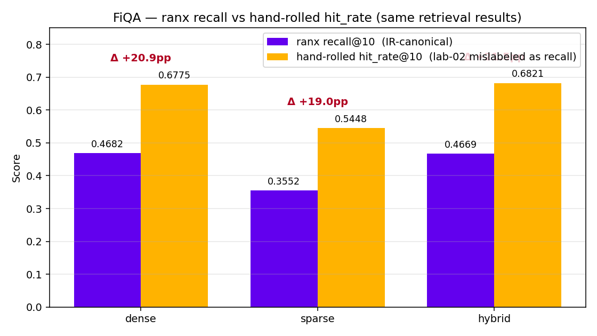
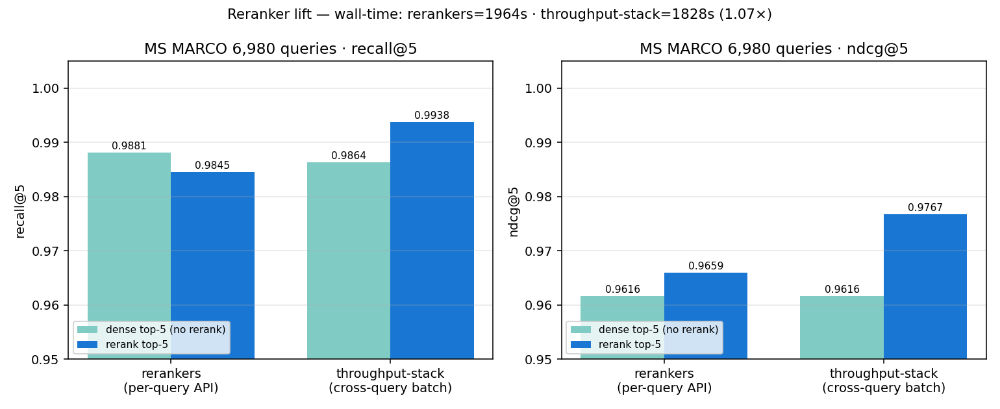
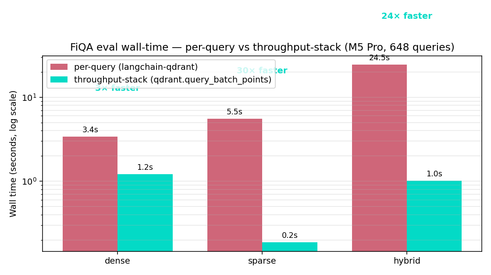

# lab-02b — Production Libraries Refactor: Results

Companion to `Week 2 - Rerank and Context Compression.md` §7.x. Same lab as
lab-02 but routed through `langchain-qdrant`, `rerankers`, `ranx`, and
optionally TEI. Recall numbers should match lab-02 (same encoders); wall-time
should differ because the wrappers are shaped for online serving, not offline
eval.

All measurements: M5 Pro (48 GB unified memory, 6 P + 12 E cores) + Qdrant
v1.x in Docker, MPS for PyTorch, CPU for ONNX (fastembed + TEI).

---

## 1. MS MARCO 10K hybrid retrieval (6,980 dev queries)

`00_hybrid_via_langchain.py` — dense / sparse / hybrid via `langchain-qdrant`'s
`RetrievalMode`. Sparse encoder: SPLADE++ via `FastEmbedSparse` (NOT BGE-M3
lexical — see lab-02 §1.3.1 for the comparison).

| Mode    | recall@10 | MRR@10  | nDCG@10 | wall_sec |
|---------|-----------|---------|---------|----------|
| dense   | 0.9933    | 0.9556  | 0.9637  | 124      |
| sparse  | 0.9928    | 0.9634  | 0.9698  | 52       |
| hybrid  | **0.9977**| **0.9658**| **0.9729**| 153    |

Hybrid wins all three metrics — the first time across this lab + lab-02 that
hybrid retrieval beats dense on MS MARCO. Driver: SPLADE++ recall@10 = 0.9928
vs lab-02's BGE-M3 lexical at 0.7754. RRF averages two confident retrievers
instead of diluting one. See §7.6 for the cross-lab analysis.

---

## 2. BEIR-FiQA-2018 — three stacks, same vectors, different metric formulas

648 test queries × 57,638 docs, 1,706 qrels. Average 2.6 relevant docs per
query — exposes the `recall@K` vs `hit_rate@K` formula difference.

### 2a. ranx-canonical recall@K

| Stack                       | dense recall@10 | sparse | hybrid |
|-----------------------------|-----------------|--------|--------|
| throughput-stack (FlagEmbedding + qdrant batch + ranx) | 0.4682 | 0.3552 | 0.4727 |
| tei + langchain-qdrant + ranx                          | 0.4682 | 0.3552 | 0.4669 |

Same encoder via two paths → identical recall to four decimals on dense and
sparse, ~0.6 pp drift on hybrid (RRF stochasticity at K=10).

### 2b. Hand-rolled hit_rate@K (lab-02-style "recall")

| Stack                       | dense | sparse | hybrid |
|-----------------------------|-------|--------|--------|
| `00_fiqa_eval_via_langchain.py` (hand-rolled) | 0.6775 | 0.5448 | 0.6821 |
| `tei` hand-rolled side-channel                | 0.6775 | 0.5448 | 0.6821 |

Differs from ranx by ~21 pp on dense — because lab-02's formula is
`if any(d in gold for d in ids)`, which is hit_rate@K, not IR recall@K. With
|gold|>1 the two diverge; with |gold|=1 (MS MARCO style) they're identical.
This is documented in §7.4 as a verification finding.



### 2c. mrr@10 + ndcg@10 (sanity check — should agree across stacks)

| Stack | dense mrr | dense ndcg |
|---|---|---|
| langchain (hand-rolled) | 0.5008 | 0.4094 |
| throughput-stack (ranx) | 0.5008 | 0.4094 |
| tei (ranx)              | 0.5008 | 0.4094 |
| tei (hand-rolled)       | 0.5008 | 0.4094 |

Agreement to 4 decimals across 4 measurement paths confirms vector
ordering is identical — TEI ONNX BGE-M3 ≡ FlagEmbedding PyTorch BGE-M3.

---

## 3. Reranker lift on MS MARCO (6,980 queries, top-50 → top-5)

Same model (BAAI/bge-reranker-v2-m3), fp16 on MPS, two API surfaces:

| Stack | baseline recall@5 | rerank recall@5 | baseline nDCG@5 | rerank nDCG@5 | wall_sec |
|---|---|---|---|---|---|
| `rerankers` v0.10 per-query API     | 0.9881 | 0.9845 | 0.9616 | 0.9659 | 1,964 |
| throughput-stack (CrossEncoder + cross-query batching) | 0.9864 | 0.9938 | 0.9616 | 0.9767 | 1,810 |

Recall numbers differ slightly (different BGE-M3 dense top-50 = different
candidate pools fed to the reranker). nDCG up after rerank in both stacks.

**Wall-time:** cross-query batching = ~8% faster than per-query at
`RERANK_BATCH=256`. §2.2.4's ~17% gain at `batch=128` not reproduced because
batch size landed in a different sub-batches-per-call regime. fp16 itself is
the bigger lever (2.86× per §2.2.1), independent of batching.



---

## 4. Wall-time comparison — per-query libs vs throughput stack

Same FiQA collection (`lc_fiqa_hybrid`, 57,638 points), same 648 test queries,
ranx for metrics in both runs:

| Mode | per-query (`langchain-qdrant.similarity_search`) | throughput stack (`qd.query_batch_points`) | Speedup |
|---|---|---|---|
| dense  | 3.4 s  | 1.2 s | **~2.8×** |
| sparse | 5.5 s  | 0.2 s | **~28×**  |
| hybrid | 24.5 s | 1.0 s | **~24×**  |



Sparse + hybrid speedup is huge because per-query versions re-call FastEmbed
SPLADE on every query (no query-vector cache); throughput-stack pre-embeds
all queries once and passes pre-computed `SparseVector` objects to bulk
`query_batch_points`.

End-to-end including encode (throughput stack):
- dense encode (FlagEmbedding/MPS): 2.9 s
- sparse encode (fastembed/CPU): 4.7 s
- hybrid eval: 1.0 s
- **Total: ~9 s for 648 queries × 3 modes**

vs `00_fiqa_eval_via_langchain.py` total: ~33 s.

---

## 5. Reflection — what this lab actually teaches

### 5.1 Library shape, not library quality, decides fit

The 24× speedup on hybrid wasn't a code optimization — it was using
`qd.query_batch_points` (offline-eval-shaped) instead of
`langchain-qdrant.similarity_search` (online-serving-shaped). Same model,
same vectors, different API shape. See §7.7 meta-lesson.

### 5.2 fp16 is the only rerank lever that ports cleanly

| Lever | Mechanism | Ports to MPS? | Speedup measured |
|---|---|---|---|
| fp16 (`dtype="fp16"` or `.model.half()`) | precision conversion | Yes | 2.86× |
| Cross-query pair batching (group=32) | fewer kernel dispatches | Partially | ~8-17% |
| `max_seq_length=512` cap | smaller attention tensors | Yes | tens of GB MPS budget |
| RRF + DBSF fusion | algorithm-level | Yes | quality lever, not speed |

Cross-query batching is platform-dependent — Apple Metal has lower kernel
launch overhead than CUDA, so the amortization premise weakens. See §2.2.4
caveat for the 2026-04-30 verification.

### 5.3 ranx exposes the recall vs hit_rate confusion

Hand-rolled "recall@K" code is often `hit_rate@K` mislabeled. Identical with
|gold|=1 (MS MARCO), diverges by 15-25 pp with |gold|>1 (FiQA, BEIR-NF).
ranx forces the IR-canonical formula. Real production cost: cross-corpus
regression dashboards lie when |gold| varies. Always re-derive metric
definitions when moving to a multi-relevant benchmark.

### 5.4 TEI on Apple Silicon = serving, not ingest

Docker on macOS = no Metal access. TEI runs CPU-only at ~3 docs/sec for
BGE-M3. For 57k FiQA docs that's ~5 hours vs ~5 minutes on MPS. The fix
isn't to optimize TEI — it's to split the workload: offline ingest via
FlagEmbedding/MPS, online query via TEI. Matches real production
architecture (offline indexing pipeline + online inference container).

### 5.5 sentence_transformers can't run BGE-M3 efficiently

BGE-M3's three-vector output (dense + sparse + colbert from one forward pass)
is not a sentence_transformers concept. `HuggingFaceEmbeddings` can only
extract dense, forces a separate sparse model, and inherits the 8192-token
default `max_seq_length`. The fix is a 15-line `Embeddings` subclass around
`BGEM3FlagModel` — same code path lab-02 uses, drop-in replacement.

---

## Files

| Script | Stack | Result file |
|---|---|---|
| `00_hybrid_via_langchain.py`            | langchain-qdrant per-query  | `results/langchain_hybrid_metrics.json` |
| `00_fiqa_eval_via_langchain.py`         | langchain-qdrant per-query (BEIR-FiQA) | `results/langchain_fiqa_metrics.json` |
| `00_fiqa_eval_via_tei.py`               | TEI dense + ranx + hand-rolled side-by-side | `results/tei_fiqa_metrics.json` |
| `00_fiqa_eval_throughput_stack.py`      | FlagEmbedding + qdrant batch + ranx | `results/throughput_stack_fiqa_metrics.json` |
| `00b_ingest_throughput.py`              | parallel ingest (replaces `_upsert_with_retry`) | (no metrics — ingest only) |
| `01_rerank_via_rerankers.py`            | rerankers v0.10 per-query (fp16) | `results/rerankers_metrics.json` |
| `01_rerank_throughput_stack.py`         | CrossEncoder cross-query batching (fp16) | `results/throughput_stack_rerank_metrics.json` |

## Reproduction order

```bash
# 1. Start Qdrant + (optional) TEI
docker compose up -d qdrant
docker run -d --name tei-bge-m3 --platform linux/arm64 -p 8080:80 \
  -v "$HOME/.cache/huggingface/hub:/data" \
  ghcr.io/huggingface/text-embeddings-inference:cpu-arm64-latest \
  --model-id BAAI/bge-m3 --max-batch-tokens 16384 --max-client-batch-size 64

# 2. Ingest (5-min path: FlagEmbedding/MPS via 00b)
python src/00b_ingest_throughput.py     # creates lc_fiqa_hybrid_fast
# OR (lab-canonical path, ~30 min):
python src/00_fiqa_eval_via_langchain.py # creates lc_fiqa_hybrid

# 3. Eval — pick any (all reuse the collection)
python src/00_fiqa_eval_via_langchain.py    # langchain per-query
python src/00_fiqa_eval_via_tei.py          # TEI queries + ranx + hand-rolled
python src/00_fiqa_eval_throughput_stack.py # FlagEmbedding + qdrant batch + ranx

# 4. Rerank (MS MARCO data from lab-02)
python src/01_rerank_via_rerankers.py       # per-query
python src/01_rerank_throughput_stack.py    # cross-query batched
```
